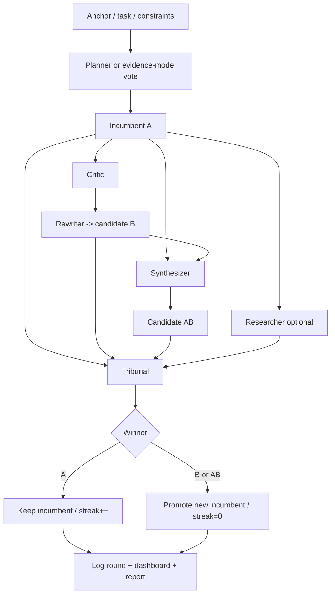
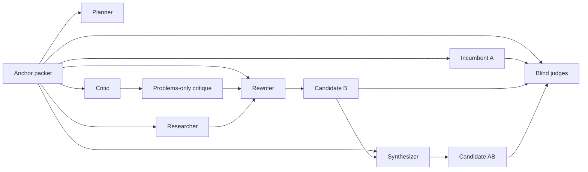
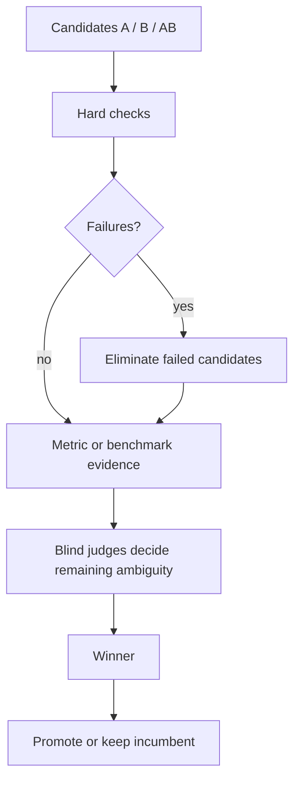

# AutoCatalyst

AutoCatalyst is a **subagent-native incumbent–challenger workflow for Codex**.

It is designed for work that benefits from **fresh perspectives, bounded context, real critique, durable logs, and evidence-aware selection** rather than one-thread roleplay. Instead of letting a single model simulate every role in one growing context window, AutoCatalyst pushes planning, research, critique, challenger generation, synthesis, and blind judging into **real subagents** with narrowly scoped packets.

That makes it useful for:

- concept descriptions
- proposals
- wireframes
- specs and implementation plans
- prompt systems
- code and feature work
- mixed research + planning + implementation tasks

## Core idea

Every round treats the task as:

- an **anchor**: the stable goal, constraints, audience, and deliverables
- an **incumbent `A`**: the current best artifact
- a **catalyst critique**: problems-only attack on `A`
- a **challenger `B`**: a revision that addresses valid criticism
- a **synthesis `AB`**: best-of-both merge of `A` and `B`
- a **tribunal**: hard checks, benchmarks, blind judges, or a hybrid mix
- **convergence**: stop when the incumbent survives repeated fresh attacks or meaningful gains flatten out

## High-level flow



## Why this exists

The main problem with “multi-role prompting” in one thread is that the roles are **not actually fresh**. They share context, they inherit bias, and the later roles have already seen too much of the debate.

AutoCatalyst is built to reduce that collapse.

It does that by:

- forcing **real subagent delegation**
- keeping each role’s packet **narrow by design**
- preserving the incumbent as a **control arm**
- choosing winners with an **evidence tribunal** instead of novelty bias
- logging each round into durable repo artifacts
- generating **Mermaid flowcharts** and a **browser report** after each run

## Role isolation and bounded context



The intended packets are:

- **planner**: anchor, scope, deliverables
- **researcher**: questions, links, repo paths
- **critic**: anchor + incumbent `A` only
- **rewriter**: anchor + `A` + critique + evidence when needed
- **synthesizer**: anchor + `A` + `B`
- **judges**: anchor + rubric + blinded `A/B/AB` only

## Evidence tribunal

AutoCatalyst does not force one evaluation style for every task.

It supports three modes:

- **judge-first** for ideas, concepts, wireframes, proposals, and other human-evaluated outputs
- **benchmark-first** for hard-signal work like performance, regression fixes, or measurable optimizations
- **hybrid** when both machine checks and human judgment matter

If the mode is ambiguous, AutoCatalyst can ask a real planner, critic, and judge to vote.



## What gets written to the repo

AutoCatalyst keeps durable state in the **target repository**, not in the skill folder.

It writes and refreshes these files:

- `autocatalyst.md`
- `autocatalyst.jsonl`
- `autocatalyst-rubric.md`
- `autocatalyst-dashboard.md`
- `autocatalyst-report.html`
- `autocatalyst-artifacts/process-overview.md`
- `autocatalyst-artifacts/session-history.md`
- `autocatalyst-artifacts/rounds/round-<n>-flow.md`

Optional repo-local hard-check hooks:

- `autocatalyst.checks.py`
- `autocatalyst.checks.ps1`
- `autocatalyst.checks.cmd`
- `autocatalyst.checks.bat`
- `autocatalyst.checks.sh`

## Browser report

After initialization and after each logged round, AutoCatalyst generates a browser-viewable report:

- `autocatalyst-report.html`

The report is designed to make a run understandable at a glance:

- session summary
- current task class and evidence mode
- round history timeline
- per-round winner and rationale
- agents that actually ran
- promoted criteria
- artifact links
- embedded Mermaid flowcharts for the overall process, session history, and each round

If Mermaid loads successfully in the browser, the diagrams render visually. If it does not, the report still remains readable and the raw Mermaid source stays visible.

## Quick start

### 1. Install the skill into a target repo

The easiest setup is **repo-local**:

```text
<your-repo>/.agents/skills/autocatalyst/
```

That makes the skill, scripts, and references live inside the repository you want to improve.

### 2. Bootstrap from the target repo root

Run the bootstrap from the **repository root**. The bootstrap is idempotent: it installs missing subagents, creates missing session files, and refreshes the dashboard, Mermaid artifacts, and browser report.

Do **not** paste literal placeholder strings like `<goal>` into shell commands. Use a real quoted value.

#### Windows PowerShell

```powershell
.\.agents\skills\autocatalyst\scripts\autocatalyst.ps1 --root . --goal "Design a markdown conversion tool for the web app" --install-agents-md
```

#### Windows cmd.exe

```cmd
.\.agents\skills\autocatalyst\scripts\autocatalyst.cmd --root . --goal "Design a markdown conversion tool for the web app" --install-agents-md
```

#### macOS / Linux / WSL

```bash
sh ./.agents/skills/autocatalyst/scripts/autocatalyst.sh --root . --goal "Design a markdown conversion tool for the web app" --install-agents-md
```

### 3. Open the generated report

After bootstrap finishes, open:

```text
autocatalyst-report.html
```

That gives you a browser-friendly overview of the current session, even before any rounds are logged.

## Direct Python entry points

If you prefer not to use the wrapper scripts, the Python helpers can be run directly.

### Bootstrap

```bash
python3 .agents/skills/autocatalyst/scripts/bootstrap.py --root . --goal "Design a markdown conversion tool for the web app" --install-agents-md
```

On Windows, prefer `py -3` when `python3` is not available:

```powershell
py -3 .agents\skills\autocatalyst\scripts\bootstrap.py --root . --goal "Design a markdown conversion tool for the web app" --install-agents-md
```

### Initialize session files directly

```bash
python3 .agents/skills/autocatalyst/scripts/init_session.py --root . --goal "Design a markdown conversion tool for the web app" --task-class hybrid --evidence-mode hybrid --install-subagents --install-agents-md
```

### Install subagents directly

```bash
python3 .agents/skills/autocatalyst/scripts/install_subagents.py --root .
```

### Refresh markdown + Mermaid + browser report

```bash
python3 .agents/skills/autocatalyst/scripts/render_dashboard.py --root .
```

### Run a repo-local checks hook

```bash
python3 .agents/skills/autocatalyst/scripts/run_checks.py --root .
```

### Log a round

```bash
python3 .agents/skills/autocatalyst/scripts/log_round.py --root . --round 1 --winner AB --status promote --winner-reason "AB merged the strongest ideas and clarified the next steps" --hard-checks pass
```

## What the wrappers do

The wrapper scripts exist so the same skill can bootstrap cleanly on:

- Windows native
- WSL2
- Linux
- macOS

Included wrappers:

- `scripts/autocatalyst.ps1`
- `scripts/autocatalyst.cmd`
- `scripts/autocatalyst.sh`

They all call the same Python bootstrap and try to find a working Python launcher automatically.

## Degraded mode

AutoCatalyst is intentionally strict about whether “fresh” roles really happened.

If subagents are missing or Codex does not actually spawn them, AutoCatalyst should say:

```text
degraded single-agent mode
```

It should then stop and wait for explicit user approval before simulating the workflow in one shared thread.

AutoCatalyst should **not** claim that a blind panel, a fresh critique, or an evidence-mode vote happened unless those child agents actually ran.

## Example output layout in a target repo

```text
.
├── AGENTS.md
├── autocatalyst.md
├── autocatalyst.jsonl
├── autocatalyst-rubric.md
├── autocatalyst-dashboard.md
├── autocatalyst-report.html
├── autocatalyst-artifacts/
│   ├── README.md
│   ├── process-overview.md
│   ├── session-history.md
│   └── rounds/
│       ├── README.md
│       └── round-001-flow.md
└── .codex/
    ├── README.autocatalyst.md
    ├── autocatalyst-config.example.toml
    └── agents/
        ├── autocatalyst_planner.toml
        ├── autocatalyst_researcher.toml
        ├── autocatalyst_critic.toml
        ├── autocatalyst_rewriter.toml
        ├── autocatalyst_synthesizer.toml
        └── autocatalyst_judge.toml
```

## Repository structure

This repository is a Codex skill bundle. The important folders are:

- `SKILL.md` — the main skill instructions and trigger description
- `agents/openai.yaml` — UI metadata
- `scripts/` — bootstrap, install, render, logging, and checks helpers
- `references/` — supporting docs for workflow, evidence modes, and subagent packets
- `assets/subagents/` — templates for the project-scoped custom agents

## Publishing notes

This repository is ready to be published as open source on GitHub.

The README uses Mermaid diagrams so the workflow can be understood visually, and the skill now ships with:

- cross-platform bootstrap wrappers
- idempotent initialization
- browser-viewable HTML reports
- Mermaid round-history artifacts
- explicit degraded-mode guardrails

## License

This project is licensed under the MIT License. See [LICENSE](LICENSE).
