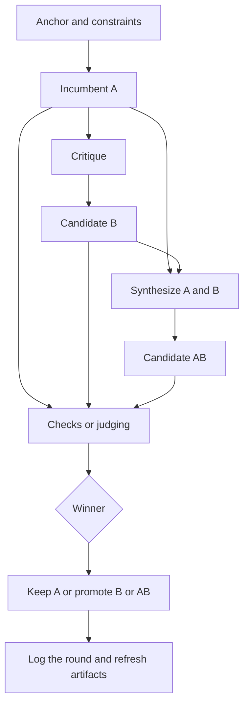

# AutoCatalyst

AutoCatalyst helps you improve a draft, spec, plan, or implementation in deliberate rounds instead of one long, fuzzy chat.

If you already have something that is good enough to challenge, but not yet good enough to trust, AutoCatalyst gives you a structured way to critique it, generate alternatives, compare them, and keep a durable record of what changed and why.

## Problem

Making a first version is often easy. Deciding whether it is actually the best version you can defend right now is harder.

That usually breaks down in predictable ways:

- feedback is shallow or inconsistent
- revisions lose the strengths of the current version
- teams argue about changes without a clear baseline
- good ideas are not logged, so the next round starts from scratch
- code or docs may pass checks but still be weak in clarity, fit, or design

AutoCatalyst exists to make that loop more disciplined.

## What AutoCatalyst Is

AutoCatalyst is a **Codex skill bundle** for running an incumbent-challenger workflow inside a repository.

A Codex skill bundle is a reusable package of instructions, scripts, references, and agent definitions that Codex can use while working in a repo.

In plain language, AutoCatalyst does this:

- starts from a stable goal and constraints
- treats the current best version as the incumbent, called `A`
- produces a critique of `A`
- produces a revised challenger, called `B`
- can also produce a synthesis, called `AB`
- evaluates the candidates with checks, judgment, or both
- keeps the winner and logs the round in repo-local files

This repository is the skill bundle itself. In a target repository, the usual repo-local install path is:

```text
.agents/skills/autocatalyst/
```

When bootstrapped, AutoCatalyst also installs project-scoped custom agents into:

```text
.codex/agents/
```

## Why It Matters

AutoCatalyst is useful when you care about both improvement and traceability.

For beginners, it gives a clearer path than "prompt harder." For experienced developers, it gives a repeatable improvement loop that keeps state in the repository instead of in memory.

It matters because it:

- keeps the current best version as a control instead of replacing it blindly
- separates critique from rewriting, which usually produces cleaner revisions
- supports both human-evaluated work and hard-signal work
- writes durable session files, round logs, and a browser report
- turns recurring criticism into rubric items, tests, or checks over time

That makes it useful for:

- concept descriptions
- proposals
- wireframes
- specs and implementation plans
- prompt systems
- code and feature work
- mixed research, planning, and implementation tasks

## Quick Start

There are two ways to get started:

1. Bootstrap it yourself with the commands below.
2. Ask Codex to use AutoCatalyst, and let the skill initialize itself if the repo is not set up yet.

Both approaches assume the skill is already available to the target repo, usually at:

```text
.agents/skills/autocatalyst/
```

### Option 1: Run the bootstrap yourself

The manual path is:

1. Put this repository inside the target repository at `.agents/skills/autocatalyst/`.
2. Open a shell in the **target repository root**.
3. Run the bootstrap command for your environment.
4. Open the generated report, then ask Codex to use AutoCatalyst for the task you want to improve.

Run these commands from the **target repo root**, not from the skill directory.

### Windows PowerShell

```powershell
.\.agents\skills\autocatalyst\scripts\autocatalyst.ps1 --root . --goal "Design a markdown conversion tool for the web app" --install-agents-md
```

### Windows cmd.exe

```cmd
.\.agents\skills\autocatalyst\scripts\autocatalyst.cmd --root . --goal "Design a markdown conversion tool for the web app" --install-agents-md
```

### macOS / Linux / WSL

```bash
sh ./.agents/skills/autocatalyst/scripts/autocatalyst.sh --root . --goal "Design a markdown conversion tool for the web app" --install-agents-md
```

The bootstrap is idempotent. You can run it again to fill in missing files, reinstall missing custom agents, or refresh derived artifacts.

After bootstrap, AutoCatalyst creates or refreshes repo-local session files, including:

- `autocatalyst.md`
- `autocatalyst.jsonl`
- `autocatalyst-rubric.md`
- `autocatalyst-dashboard.md`
- `autocatalyst-report.html`
- `autocatalyst-artifacts/...`

Open:

```text
autocatalyst-report.html
```

### Option 2: Invoke the skill and let Codex initialize it

If Codex is using the AutoCatalyst skill, it is already instructed to bootstrap automatically before doing real work when setup is missing.

That means if files such as `autocatalyst.md` or `.codex/agents/autocatalyst_critic.toml` do not exist yet, Codex should initialize the repo before starting the first full AutoCatalyst round.

In practice, the flow is:

1. Put the skill in the target repo, usually at `.agents/skills/autocatalyst/`.
2. Ask Codex to use AutoCatalyst for a real task.
3. If the session files or custom agent files are missing, Codex should bootstrap them first.
4. AutoCatalyst then continues with the actual task.

This automatic path is part of the skill instructions and matches the idempotent behavior of the bootstrap scripts.

## How Many Rounds Does It Run?

AutoCatalyst does not run for a fixed hard-coded number of rounds like "always do 3."

Instead, it uses a convergence rule. The main automatic control is the **survival target**:

- when the incumbent wins a round as `A` with `status=keep`, the survival streak increases
- when a challenger wins as `B` or `AB` with `status=promote`, the survival streak resets
- when the survival streak reaches `survivalTarget`, AutoCatalyst should stop

The default `survivalTarget` is `2`, which means the incumbent must survive two fresh challenge rounds before the loop stops on that rule.

You can set it during setup:

```bash
python3 .agents/skills/autocatalyst/scripts/bootstrap.py --root . --goal "Design a markdown conversion tool for the web app" --survival-target 3 --install-agents-md
```

After each round, AutoCatalyst can compute the current stop/continue decision with:

```bash
python3 .agents/skills/autocatalyst/scripts/check_convergence.py --root .
```

Other stop conditions still matter too, such as flattening benchmark gains, repeated minor feedback, user interruption, or reaching a good enough handoff state.

## What A Round Looks Like

Think of one round like this:

1. Keep the current best version.
2. Critique it.
3. Create a challenger.
4. Compare the options.
5. Keep or promote the winner.
6. Log what happened.

The core terms are simple:

- **Anchor**: the stable objective, audience, constraints, and deliverables
- **Incumbent `A`**: the current best version
- **Critique**: the strongest problems found in `A`
- **Candidate `B`**: a rewrite that addresses the strongest valid critique
- **Candidate `AB`**: a synthesis of the best parts of `A` and `B`
- **Tribunal**: the way candidates are evaluated, using checks, benchmarks, judges, or a mix



In practice, AutoCatalyst uses focused custom agents for planning, research, critique, rewriting, synthesis, and judging. Those agents are installed into `.codex/agents/`.

## When To Use It

Use AutoCatalyst when:

- you already have a draft, implementation, or direction worth challenging
- the work benefits from multiple rounds instead of one-shot output
- you want changes to be auditable in the repository
- you care about both improvement and decision quality
- you want critique to become reusable rubric items or checks over time

It is usually not the right tool when:

- the task is a trivial one-step edit
- you only need a quick factual lookup
- there is no real incumbent to compare against and no reason to log rounds

## Evaluation Modes

AutoCatalyst supports three evaluation styles:

- `judge-first` for work where clarity, usefulness, persuasion, or design quality matter most
- `benchmark-first` for work where tests, performance, regressions, or metrics dominate
- `hybrid` when both machine checks and human judgment matter

## Choosing Models For Different Roles

AutoCatalyst can use different models for different subagents, but the control point is important:

- `.codex/agents/*.toml` defines what each role does
- the parent agent chooses the actual `model` and `reasoning_effort` when it spawns each subagent
- if you do nothing, subagents inherit the parent/default model

If you want repo-local control, copy the generated example file:

```text
.codex/autocatalyst-models.example.toml
```

to:

```text
.codex/autocatalyst-models.toml
```

Then adjust it. A typical split is:

```toml
[defaults]
model = "gpt-5.4-mini"
reasoning_effort = "medium"

[roles.rewriter]
model = "gpt-5.4"
reasoning_effort = "high"

[roles.synthesizer]
model = "gpt-5.4"
reasoning_effort = "high"
```

Before spawning subagents, resolve the effective profiles with:

```bash
python3 .agents/skills/autocatalyst/scripts/resolve_subagent_profiles.py --root .
```

The parent agent should then pass the returned `model` and `reasoning_effort` values into each spawn call. This is how you make planners, critics, and judges cheaper while keeping rewrites or synthesis on a stronger model when needed.

## Runtime Limits In This Repository

This repository now includes a real repo policy file at:

```text
.codex/config.toml
```

That file is **active policy in this repository**, not just an example.

The current values are:

- `max_threads = 6`
- `max_depth = 1`

In plain language:

- up to 6 agent threads can be active at once
- child agents should not create deeper nested agent trees

Why these values were chosen:

- AutoCatalyst often needs a small panel instead of one helper, for example 3 judges in a blind tribunal or 3 agents in an evidence-mode vote.
- `max_threads = 6` leaves room for that normal fan-out plus a little headroom without encouraging uncontrolled parallelism.
- `max_depth = 1` keeps the workflow understandable: the main agent may spawn the AutoCatalyst role agents, but those child agents should not keep spawning their own child trees.

This matters because AutoCatalyst is designed to get fresh, bounded perspectives from a few narrowly scoped agents, not to create a large recursive swarm. The limit keeps cost, latency, and coordination overhead under control.

What this means in practice:

- a normal judging step with 3 judges fits comfortably inside the limit
- an evidence-mode vote with planner + critic + 1 judge also fits comfortably
- the skill can still do some bounded parallel read-heavy work
- but it should avoid runaway fan-out and nested delegation chains

If you want different behavior in another repository, set that repository's own `.codex/config.toml`. The values in this repo do not automatically control every target repo that installs the skill.

By contrast, these files are still **illustrative examples** for target repos:

- `.codex/autocatalyst-config.example.toml`
- `.codex/autocatalyst-models.example.toml`

Those example files are templates that a target repo can copy or adapt. They do not become active policy until that target repo installs them as real config.

## What Gets Written To The Repo

AutoCatalyst keeps its session state in the target repository, not in the skill bundle.

Main generated files:

- `autocatalyst.md`
- `autocatalyst.jsonl`
- `autocatalyst-rubric.md`
- `autocatalyst-dashboard.md`
- `autocatalyst-report.html`
- `autocatalyst-artifacts/`

Common generated artifacts include:

- `autocatalyst-artifacts/process-overview.md`
- `autocatalyst-artifacts/session-history.md`
- `autocatalyst-artifacts/rounds/round-<n>-flow.md`

If you want repo-local hard checks, AutoCatalyst can use supported hooks such as:

- `autocatalyst.checks.py`
- `autocatalyst.checks.ps1`
- `autocatalyst.checks.cmd`
- `autocatalyst.checks.bat`
- `autocatalyst.checks.sh`

## Direct Script Entry Points

If you prefer not to use the wrapper scripts, the Python helpers can be run directly from the **target repo root**.

### Bootstrap

```bash
python3 .agents/skills/autocatalyst/scripts/bootstrap.py --root . --goal "Design a markdown conversion tool for the web app" --install-agents-md
```

On Windows, use `py -3` when needed:

```powershell
py -3 .agents\skills\autocatalyst\scripts\bootstrap.py --root . --goal "Design a markdown conversion tool for the web app" --install-agents-md
```

### Initialize session files

```bash
python3 .agents/skills/autocatalyst/scripts/init_session.py --root . --goal "Design a markdown conversion tool for the web app" --task-class hybrid --evidence-mode hybrid --install-subagents --install-agents-md
```

### Install custom agents

```bash
python3 .agents/skills/autocatalyst/scripts/install_subagents.py --root .
```

### Refresh dashboard, Mermaid artifacts, and browser report

```bash
python3 .agents/skills/autocatalyst/scripts/render_dashboard.py --root .
```

### Check whether another round should run

```bash
python3 .agents/skills/autocatalyst/scripts/check_convergence.py --root .
```

### Resolve per-role model profiles

```bash
python3 .agents/skills/autocatalyst/scripts/resolve_subagent_profiles.py --root .
```

### Run a repo-local checks hook

```bash
python3 .agents/skills/autocatalyst/scripts/run_checks.py --root .
```

### Log a round

```bash
python3 .agents/skills/autocatalyst/scripts/log_round.py --root . --round 1 --winner AB --status promote --winner-reason "AB merged the strongest ideas and clarified the next steps" --hard-checks pass
```

If the skill is installed globally instead of inside the repo, run the same bootstrap or helper scripts by absolute path, but still execute them from the target repo root and keep `--root .` pointed at that repo.

## What's In This Repository

This repository is the AutoCatalyst skill bundle. The main parts are:

- `SKILL.md`
- `agents/openai.yaml`
- `scripts/`
- `references/`
- `assets/subagents/`

## Degraded Mode

AutoCatalyst is intentionally strict about whether fresh roles actually ran.

If custom agents are missing or Codex does not actually spawn them, the workflow should report:

```text
degraded single-agent mode
```

It should then stop unless the user explicitly accepts the fallback. It should not claim that a blind panel, fresh critique, or evidence-mode vote happened unless those child agents actually ran.

## License

This project is licensed under the MIT License. See [LICENSE](LICENSE).
