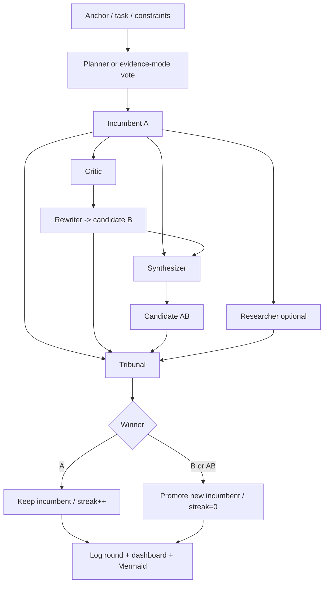
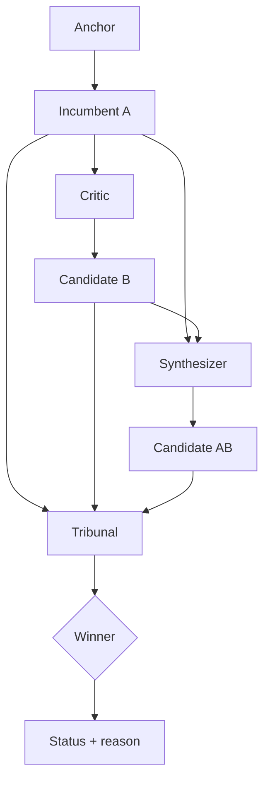
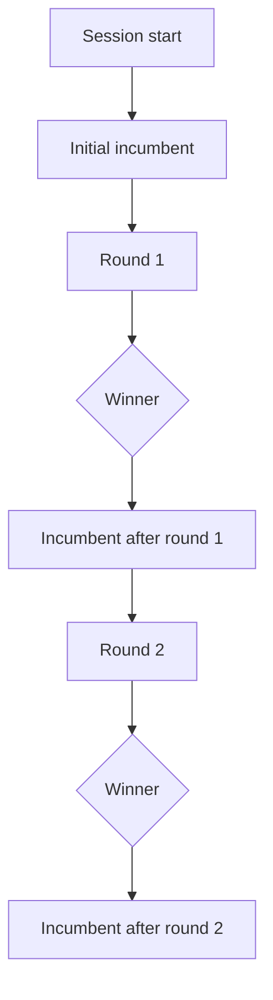

# Artifact Templates

Use these as defaults. Adjust the structure when the task clearly needs something else.

## Concept description template

```markdown
# <Concept name>

## One-sentence summary
<What it is, for whom, and what makes it distinct>

## Problem
<What pain or missed opportunity this addresses>

## Core idea
<The mechanism or interaction model>

## Why now
<Why the timing, tools, or market context makes it plausible>

## User experience
<What the user sees, does, and gets>

## Differentiators
- <point>
- <point>
- <point>

## Risks and open questions
- <point>
- <point>

## V1 scope
<The smallest credible first version>
```

## Proposal template

```markdown
# Proposal: <title>

## Objective
## Background and context
## Proposed approach
## Alternatives considered
## Benefits
## Risks
## Dependencies
## Milestones / phases
## Recommended next step
```

## Wireframe template

```markdown
# Wireframe: <feature>

## Goals
## Primary user flow
## Screen or viewport layout
## Key UI elements
## States and transitions
## Edge cases
## Notes for implementation
```

For text wireframes, use blocks, bullets, or ASCII layouts.

## Spec template

```markdown
# Spec: <title>

## Goal
## Non-goals
## Requirements
## User stories / flows
## Data or API considerations
## Acceptance criteria
## Risks and tradeoffs
## Open questions
```

## Implementation plan template

```markdown
# Implementation Plan: <title>

## Goal
## Current state
## Proposed changes
## Files or modules in scope
## Step-by-step plan
## Validation plan
## Rollback / mitigation
## Follow-up opportunities
```

## Change summary template

```markdown
# Change Summary

## What changed
## Why it won this round
## Evidence used
## Risks still remaining
## Next candidate improvements
```

## Rubric template

```markdown
# AutoCatalyst Rubric

## Core criteria
- Fits the stated objective and audience
- Meets hard constraints
- Is specific enough to act on
- Improves the task materially, not cosmetically

## Promoted criteria
- <Add recurring critiques here>
```

## Round casefile template

```markdown
# Round <n> Casefile

## Summary
<One short paragraph explaining what this round changed and why it mattered>

## The Ask
<What the user wanted, in plain language>

## The Situation Before The Round
<What the incumbent was doing and why that was not good enough>

## The Session Replay
- <Meaningful event in order>
- <Meaningful event in order>
- <Meaningful event in order>

## The Contenders
<Short comparison of A, B, and AB as competing directions>

## The Decision
<Who won and why, in plain language>

## The Outcome
<What changed because of the decision>

## Unknowns And Limits
- <What is still unresolved>
```

## Tribunal summary template

```markdown
# Round <n> Tribunal Summary

## Blind setup
- candidate map: <path>
- judge packet files:
  - <path>
  - <path>
  - <path>

## Verdict collection
- judge 1: <pending or result path>
- judge 2: <pending or result path>
- judge 3: <pending or result path>

## Aggregation
- method: <majority / Borda / conservative promotion>
- result: <winner>
- note: <why the aggregation landed there>
```

## Structured tribunal summary template

```json
{
  "schema": "autocatalyst.tribunal.v1",
  "round": 1,
  "candidateMapArtifact": "autocatalyst-artifacts/rounds/round-001-candidate-map.json",
  "judgePackets": [
    "autocatalyst-artifacts/rounds/round-001-judge-1-packet.md",
    "autocatalyst-artifacts/rounds/round-001-judge-2-packet.md",
    "autocatalyst-artifacts/rounds/round-001-judge-3-packet.md"
  ],
  "judgeVerdicts": [
    {
      "judge": "judge1",
      "artifact": "autocatalyst-artifacts/rounds/round-001-judge-1-verdict.md",
      "ranking": ["Candidate 2", "Candidate 1", "Candidate 3"],
      "winner": "Candidate 2",
      "rationale": "Candidate 2 best matched the rubric overall.",
      "blockers": []
    }
  ],
  "aggregationMethod": "majority ranking after unblinding",
  "result": "AB",
  "note": "AB carried the panel after unblinding."
}
```

## Structured judge output template

````markdown
## Structured Output

```json
{
  "schema": "autocatalyst.judge.v1",
  "ranking": ["Candidate 2", "Candidate 1", "Candidate 3"],
  "winner": "Candidate 2",
  "rationale": "Candidate 2 matched the rubric best overall.",
  "blockers": []
}
```
````

## Structured critic output template

````markdown
## Structured Output

```json
{
  "schema": "autocatalyst.critic.v1",
  "rewriteWarranted": true,
  "hardBlockers": ["The current README never explains what the skill does to a first-time user."],
  "softConcerns": ["The examples are denser than they need to be."],
  "suggestedRubricItems": ["Must explain the core purpose before comparing workflow variants."]
}
```
````

## Structured researcher output template

````markdown
## Structured Output

```json
{
  "schema": "autocatalyst.researcher.v1",
  "confirmedFacts": [
    {
      "claim": "The repo has no GitHub Actions workflows.",
      "citation": "[.github/] missing"
    }
  ],
  "unresolvedQuestions": ["Whether Windows bootstrap behavior has been smoke-tested outside local manual runs."],
  "implications": ["The repo needs automated platform coverage before making platform support claims."],
  "conflicts": []
}
```
````

## Mermaid process overview template

````markdown
# AutoCatalyst Process Overview


````

## Mermaid round flow template

````markdown
# Round <n> Flow


````

## Mermaid session history template

````markdown
# Session History


````
