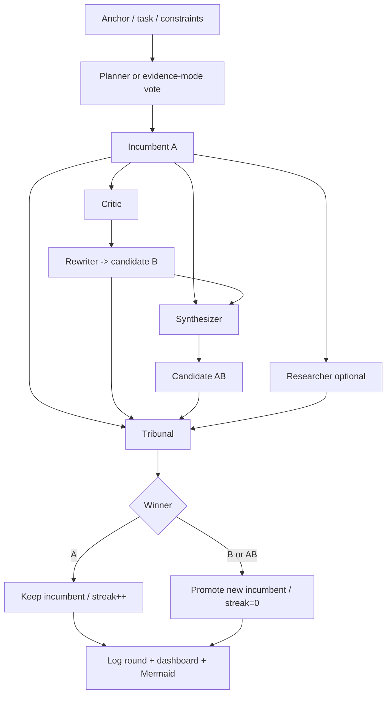
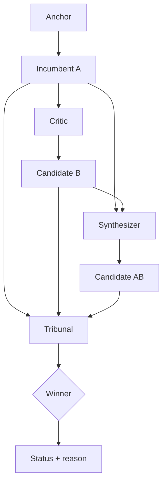
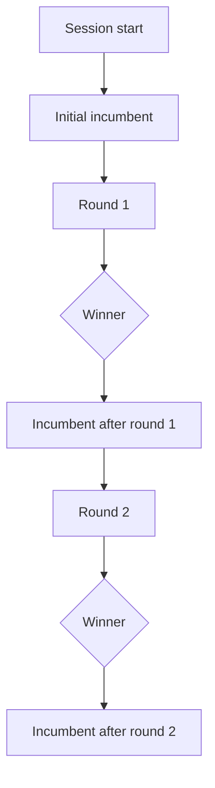

# Artifact Templates

Use these as defaults. Adjust the structure when the task clearly needs something else.

## Concept description template

```markdown
# <Concept name>

## One-sentence summary
<What it is, for whom, and what makes it distinct>

## Problem
<What pain or missed opportunity this addresses>

## Core idea
<The mechanism or interaction model>

## Why now
<Why the timing, tools, or market context makes it plausible>

## User experience
<What the user sees, does, and gets>

## Differentiators
- <point>
- <point>
- <point>

## Risks and open questions
- <point>
- <point>

## V1 scope
<The smallest credible first version>
```

## Proposal template

```markdown
# Proposal: <title>

## Objective
## Background and context
## Proposed approach
## Alternatives considered
## Benefits
## Risks
## Dependencies
## Milestones / phases
## Recommended next step
```

## Wireframe template

```markdown
# Wireframe: <feature>

## Goals
## Primary user flow
## Screen or viewport layout
## Key UI elements
## States and transitions
## Edge cases
## Notes for implementation
```

For text wireframes, use blocks, bullets, or ASCII layouts.

## Spec template

```markdown
# Spec: <title>

## Goal
## Non-goals
## Requirements
## User stories / flows
## Data or API considerations
## Acceptance criteria
## Risks and tradeoffs
## Open questions
```

## Implementation plan template

```markdown
# Implementation Plan: <title>

## Goal
## Current state
## Proposed changes
## Files or modules in scope
## Step-by-step plan
## Validation plan
## Rollback / mitigation
## Follow-up opportunities
```

## Change summary template

```markdown
# Change Summary

## What changed
## Why it won this round
## Evidence used
## Risks still remaining
## Next candidate improvements
```

## Rubric template

```markdown
# AutoCatalyst Rubric

## Core criteria
- Fits the stated objective and audience
- Meets hard constraints
- Is specific enough to act on
- Improves the task materially, not cosmetically

## Promoted criteria
- <Add recurring critiques here>
```

## Mermaid process overview template

````markdown
# AutoCatalyst Process Overview


````

## Mermaid round flow template

````markdown
# Round <n> Flow


````

## Mermaid session history template

````markdown
# Session History


````
